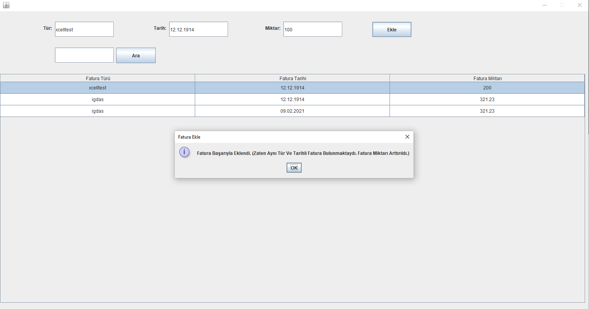
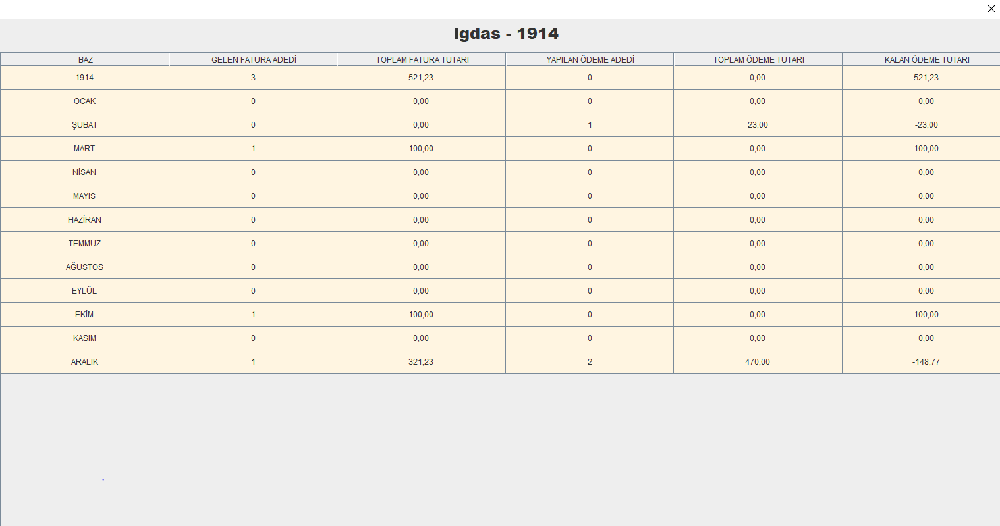
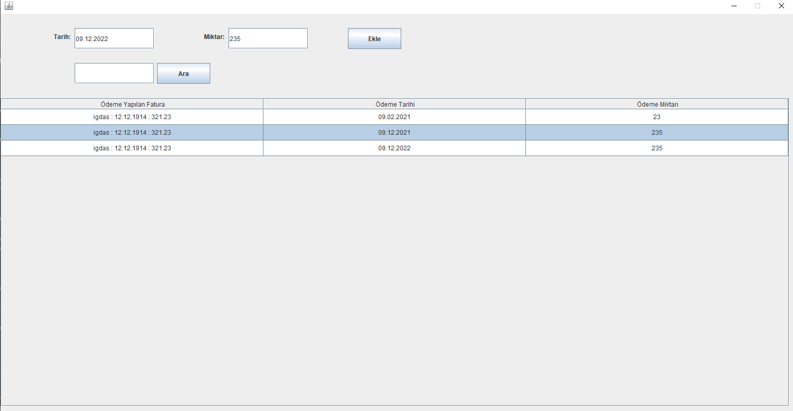
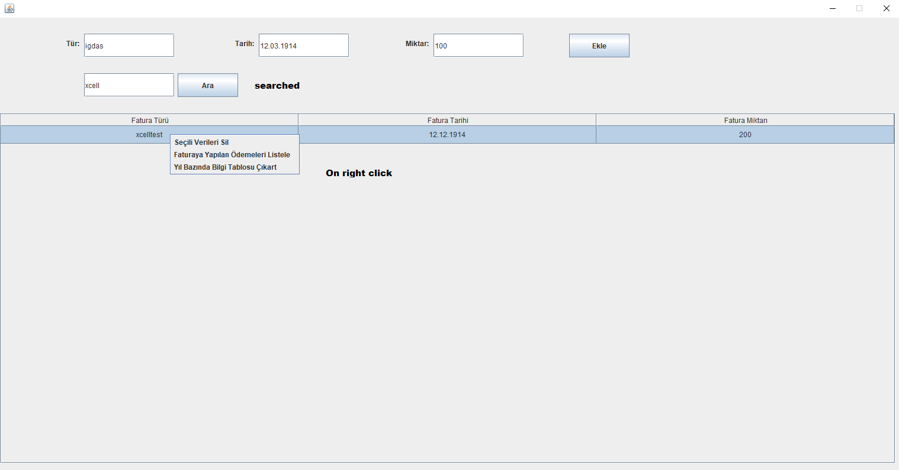

### Project Information
--- 
* Project Name:  
Tax Manager
 

* Project Team:  
Fadıl Şahin
 

* Project Start Date:  
August 2018
 

* Project State And Duration:  
Done, 3 days
 

* Project Description:  
This app is developed to manage bills. With this app user can save,delete and search bills and also can save,delete and search payment to the bills. Also it is possible to make an analysis table for a year for each bill type. After typed necessery informations to textfields, a bill type can be created. The first ui page is used for this and this page contains information of bill debts. Also it is possible to search a bill. Bills can be updated via double click on records and via right click, pop up menu operations can be selected. For payment table, same oprations are valid.
**Note: There must be 'faturalar' folder inside executable jar file's folder to make the program work**
 
 

:exclamation: --------------------------------------------------------------------------------- :exclamation:

- ***Executable jar is inside [root](tax-manager.jar) folder***

:exclamation: --------------------------------------------------------------------------------- :exclamation:

### Screenshots
---

### Bills Table

### Annual Analysis Table

### Payment Table

### Search and Pop Up Menu

